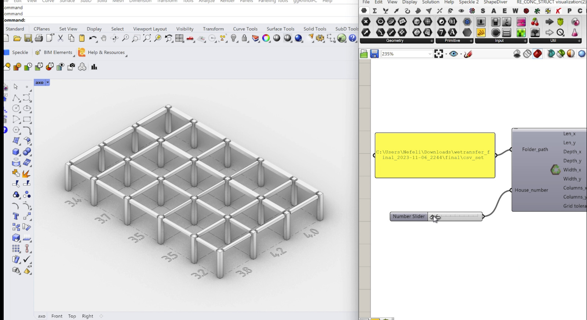

# RE_CONC_STRUCT

## Introduction

The provided Python script is part of the "RE_CONC_STRUCT" project, a tool designed for generating concrete structures for mass housing while optimizing the use of existing concrete stock. The script incorporates various functionalities, including data manipulation using pandas, numerical operations using numpy, and execution time tracking using the time module. It prompts users for input on parameters such as the number of houses, dimensions, and location.

The tool optimizes the selection of concrete grids by considering factors like distance from warehouses, weight optimization, and self-weight of the structure. It uses modules for warehouse combinations, axial combinations, grid attribute generation, tributary loading area distribution, static analysis, and optimization.

Upon user confirmation, the tool reserves the selected stock, generates Excel sheets with details of the reserved stock, and updates the inventory. The script is comprehensive, involving a multi-step process that integrates data analysis, optimization, and user interaction to facilitate efficient and sustainable concrete structure generation for mass housing.

## Key Objectives

1. **Concrete Structure Generation:** Generate tailored concrete structures for mass housing.
2. **Reuse of Existing Concrete Stock:** Optimize use of existing concrete stock to minimize waste.
3. **User-Driven Customization:** Allow user input for customized parameters in structure generation.
4. **Distance Optimization:** Optimize concrete grid selection based on distance from warehouses.
5. **Weight Optimization:** Optimize concrete grid selection considering truck weight limits.
6. **Self-Weight Analysis:** Conduct static analysis for structural stability, including self-weight.
7. **Interactive Visualization:** Provide interactive visualizations like transportation maps.
8. **Stock Reservation and Purchase:** Enable users to reserve and purchase selected concrete stock.
9. **Documentation and Reporting:** Generate detailed documentation and reports for user reference.
10. **Promotion of Sustainable Construction Practices:** Encourage sustainable construction by reusing materials and optimizing resources.

These objectives collectively aim to streamline the process of generating concrete structures for mass housing, emphasizing efficiency, sustainability, and user-centric customization.

## Prerequisites

### 1. Python

Ensure that Python is installed on your machine. You can download Python from the [official Python website](https://www.python.org/downloads/).
Create a virtual environment and activate it. [Here](https://docs.python.org/3/library/venv.html), you can find instructions on how to do this.

### 2. Libraries

To install the libraries, run:

```bash
pip install -r requirements.txt
```

## Development Setup

### Directory Structure

```plaintext
Reconstruct
├── for_the_server/
    └── revised_code/
        ├── main.py
        └──s1_Dataframe_generator.py
├── grasshopper/ 
    ├── Hops2.py
    └── RE_CONC_STRUCT visualization.gh
└── outputs/
    ├── csv_set/
    └──maps/
```

- **main.py:** Starting point.
- **csv_set/:** A directory to store the generated CSV files.
- **Dataframe2.csv:** Input CSV file (change the name accordingly).


## Running the Code

2. **Run Dataframe_Generator script:**
   - If you don’t have a dataframe or want to generate one, run the `s1_Dataframe_generator.py` script.
   - If you want to work with an existing dataframe, you can cross-check it with `Dataframe2.csv` to validate your dataframe.
3. **Run `main.py` to generate possible grids:**
   - Input your parameters according to the [script's prompts](#User-Prompts)
   - Check the generated graph for the grids of interest.
   - Fill in the grid of interest in the terminal.
4. **Check the files generated and stored in the folder `outputs`.**
5. **Run Hops to visualize the grid:**
   - Install Rhino and Grasshopper.
   - Open the `Hops` folder and run the `Hops2.py` script in Python.
   - Open the Grasshopper script file in Grasshopper (`grasshopper/RE_CONC_STRUCT visualization.gh`)
   - On the Grasshopper script, insert the folder path to the `outputs` folder.
   - Input the grid number you want to generate.

<p align="center">

</p>


## User Prompts

1. Place the required number of houses here: Enter the number of houses.
2. Enter latitude and longitude: Specify the location by entering latitude and longitude.
3. Please specify x dimension in meters: Specify the x dimension (length) of houses in meters.
4. Please specify y dimension in meters: Specify the y dimension (width) of houses in meters.
5. Please specify tolerance for deviation from given dimensions in meters: Specify the tolerance for deviation from given dimensions in meters.
6. Place the file-path to download Excel sheets of your houses: Provide the file path for downloading Excel sheets.
7. Would you like to buy the stock? (Yes/No): Confirm whether you'd like to reserve and purchase the stock.
8. Place the chosen grid number here: Enter the chosen grid number for further analysis.
9. Place the chosen warehouse combination here: Enter the chosen warehouse combination by providing a sequence of warehouse numbers.

## Review Results

After the code execution, review the results, including the best grids for distance and weight. Confirm if you want to reserve the stock. If yes, the Excel sheets with reserved stock information will be generated in the `csv_set` directory.

## Additional Tips

- **Customization:**
  - Feel free to customize the code for specific needs, adjusting parameters within the script.
- **Troubleshooting:**
  - If you encounter any issues, ensure that the input CSV file (`Dataframe2.csv`) is correctly formatted and located in the project directory.
  - Double-check the user inputs and paths provided during the script execution.
- **Contact Support:**
  - If you have further questions or encounter difficulties, feel free to reach out for support.

---